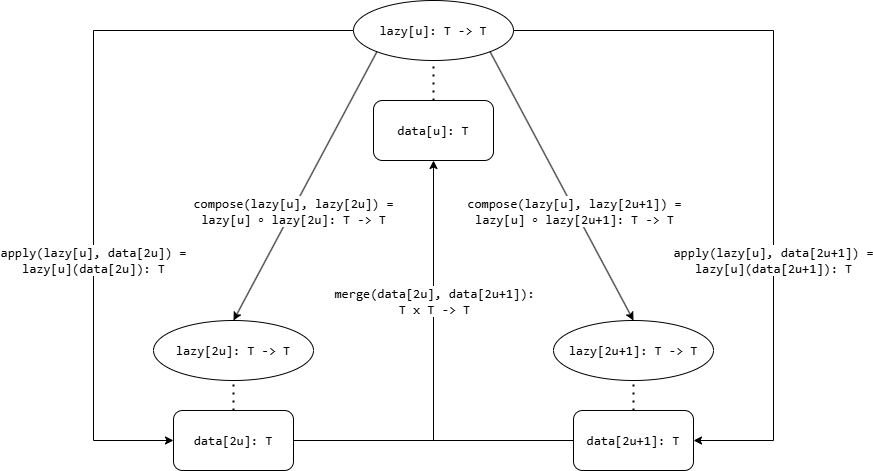

## Giới thiệu

[Cấu trúc dữ liệu](https://wiki.vnoi.info/algo/data-structures/data-structures-overview) là một trong những kiến thức quan trọng nhất trong lập trình thi đấu bởi sự hữu dụng trong việc quản lí, truy cập và thay đổi dữ liệu một cách nhanh chóng. Tuy nhiên, sự phức tạp trong việc cài đặt chúng là sự bất tiện không hề nhỏ với tất cả mọi người. Do vậy, nhiều bạn thường sử dụng thư viện code (library) để rút ngắn thời gian cài đặt, nhưng một vấn đề mới xuất hiện là việc thiết kế một thư viện có đầy đủ tính năng, và áp dụng được với tất cả mọi tình huống.

Bài viết này sẽ tập trung về việc tổng quát hóa các cấu trúc dữ liệu thường gặp - [Sparse Table](https://wiki.vnoi.info/algo/data-structures/rmq), [Segment Tree](https://wiki.vnoi.info/algo/data-structures/segment-tree-basic) - bằng lí thuyết nhóm ([Group theory](https://en.wikipedia.org/wiki/Group_theory)), và cách cài đặt chúng.

_Tác giả muốn gửi lời cảm ơn đến thư viện [Algorithms](https://github.com/Aeren1564/Algorithms/) của Aeren, nguồn cảm hứng cho bài viết này._

## Ghi chú

Tuy không bắt buộc, nhưng độc giả nên đọc trước về các thuật toán và cấu trúc dữ liệu ở trên để đọc bài viết này một cách suôn sẻ nhất. Tác giả sẽ chỉ đề cập qua về ý tưởng chính của các thuật toán trên, mà không đi sâu vào lí do và cách hoạt động.

Để nhất quán với thư viện Algorithms trên, ta sẽ thống nhất rằng:

- Mảng đánh số bắt đầu từ $0$ ($0$-index). Khi ta nói "Mảng A có $N$ phần tử", ta mặc định rằng mảng được đánh số từ $0$ đến $N - 1$.
- Mọi khoảng trong mảng đều là nửa khoảng $[l, r)$ (half-open interval). Cụ thể hơn, khoảng này chứa mọi số $i$ thỏa mãn $l \le i < r$.

## Sparse Table

### Bài toán cổ điển

> Cho một mảng $A$ có $N$ số nguyên và $Q$ truy vấn có dạng $[l, r)$. Với mỗi truy vấn, hãy tìm giá trị nhỏ nhất trong khoảng $[l, r)$.

#### Lời giải

Gọi $L = \lfloor \log N \rfloor + 1$. Ta định nghĩa mảng hai chiều $\text{ST}$ có kích thước $[0, L) \times [0, N)$, với giá trị của $\text{ST}[j][i]$ là

$
\text{ST}[j][i] = \min_{k \in [i, i + 2^j)} A_k \\ \\ = \min\left(\min_{k \in [i, i + 2^{j-1})} A_k, \min_{k \in [i + 2^{j-1}, i + 2^j)} A_k\right) \\ \\
= \min(\text{ST}[j - 1][i], \text{ST}[j - 1][i + 2^{j-1}]) \\
$

Để trả lời truy vấn $[l, r)$, gọi $j = \lfloor \log (r - l) \rfloor$, khi đó:

$\min_{k \in [l, r)} A_k = \min\left(\min_{k \in [l, l + 2^j)} A_k, \min_{k \in [r - 2^j, r)} A_k\right) \\ \\ = \min(\text{ST}[j][l], \text{ST}[j][r - 2^j]) \\$

Độ phức tạp là $\mathcal{O}(N \log N + Q)$.

#### Cài đặt

```cpp
struct sparse_table{
    int n;
    vector <vector <int>> st;

    void build(const vector <int>& a){
        n = ssize(a);
        int l = __lg(n) + 1;
        st.assign({a});
        st.resize(l);
        for (auto j = 1; j < l; j++){
            st[j].resize(n - (1 << j) + 1);
            for (auto i = 0; i + (1 << j) <= n; i++){
                st[j][i] = min(st[j - 1][i],
                               st[j - 1][i + (1 << (j - 1))]);
            }
        }
    }

    int query(int l, int r){
        int j = __lg(r - l);
        return min(st[j][l], st[j][r - (1 << j)]);
    }
};
```

### Bài toán tổng quát

Đầu tiên, ta phải làm tổng quát bài toán trước. Ta biết rằng mảng $A$ có thể chứa nhiều kiểu biến/dữ liệu khác nhau (số nguyên, số hữu tỉ, số thực, số phức, ...), và truy vấn có thể hỏi về các hàm khác nhau ($\min$, $\max$, $\gcd$, ...). Gọi kiểu biến trên là $\text{T}$ và hàm là $\text{merge}$, ta có bài toán tổng quát như sau:

> Cho một mảng $A$ có $N$ phần tử thuộc $\text{T}$ $(A_i \in \text{T})$ và $Q$ truy vấn có dạng $[l, r)$. Với mỗi truy vấn, hãy tìm $\text{merge}(A_{[l, r)}) = \text{merge}(A_l, \dots, A_{r-1})$.

#### Nhận xét

Ta có một vài nhận xét như sau:

- $\text{merge}$ là một phép toán hai ngôi ([binary operation](https://en.wikipedia.org/wiki/Binary_operation)) trên $\text{T}$; nói cách khác, $$\text{merge}: \text{T} \times \text{T} \to \text{T}$$
- Để định nghĩa $\text{merge}(A[l, r))$, ta cần tính chất giao hoán ([associative](https://en.wikipedia.org/wiki/Associative_property)) của $\text{merge}$:
  $$ \text{merge}(a, \text{merge}(b, c)) = \text{merge}(\text{merge}(a, b), c)$$ $$\quad \forall a, b, c \in \text{T}$$
  Tính chất này là cần thiết để biểu thức trêntrên có cách biểu diễn là $\text{merge}(a, b, c)$; và mở rộng hơn là $\text{merge}(a_1, \dots, a_n) = \text{merge}(a_1, \text{merge}(\dots, \text{merge}(a_{n-1}, a_n)))$.
- Để thuận tiện, ta định nghĩa phần tử đơn vị của $\text{T}$, gọi là $\text{T}_\text{id}$. Phần tử này thỏa mãn:
  $$\text{merge}(a, \text{T}_\text{id}) = \text{merge}(\text{T}_\text{id}, a) = a \quad$$ $$\forall a \in \text{T}$$
  Từ đây ta có định nghĩa rằng $\text{T}(A_{[i, i)}) = \text{T}_\text{id} \\$

Ba nhận xét trên chính là ba tiên đề của [monoid](https://en.wikipedia.org/wiki/Monoid)
Nói cách khác, $\text{T}$ là một monoid với phép toán $\text{merge}$ và phần tử đơn vị $\text{T}_\text{id}$.

Ngoài ra, để Sparse Table vẫn hoạt động chính xác, ta phải có thêm điều kiện sau:

- Xét $A = [\text{T}_\text{id}, a, \text{T}_\text{id}]$ $(a \in \text{T})$ và truy vấn $[l, r) = [0, 3)$. Theo thuật toán Sparse Table, ta có:
  $\text{merge}(A_{[0, 3)}) \\ = \text{merge}(\text{merge}(A_{[0, 2)}),\text{merge}(A_{[1, 3)}))$
  $\text{merge}(\text{T}_\text{id}, a, \text{T}_\text{id}) \\ = \text{merge}(\text{merge}(\text{T}_\text{id}, a), \text{merge}(a, \text{T}_\text{id}))$
  $$a = \text{merge}(a, a)$$
  Vậy $\text{merge}$ phải thỏa mãn tính chất [idempotence](https://en.wikipedia.org/wiki/Idempotence): $a = \text{merge}(a, a) \, \forall a \in \text{T}$.

Điều kiện này cũng là điều kiện đủ để bài toán có thể được giải bằng Sparse Table. Thật vậy, ta có:

$\text{merge}(\text{ST}[j][l], \text{ST}[j][r - 2^j]) \\$
$= \text{merge}(A_{[l, l + 2^j)}, A_{[r - 2^j, r)}) \\$
$= \text{merge}(\text{merge}(A_{[l, r - 2^j)}, A_{[r - 2^j, l + 2^j)}), \\ \quad \text{merge}(A_{[r - 2^j, l + 2^j)}, A_{[l + 2^j, r)})) \\$
$= \text{merge}(A_{[l, r - 2^j)}, \text{merge}(A_{[r - 2^j, l + 2^j)}, A_{[r - 2^j, l + 2^j)}), A_{[l + 2^j, r)}) \\$
$= \text{merge}(A_{[l, r - 2^j)}, A_{[r - 2^j, l + 2^j)}, A_{[l + 2^j, r)}) \\$
$= \text{merge}(A_{[l, r)})\\$

Một số ví dụ của bài toán thỏa mãn những điều kiện trên là:

- $\text{T}$ là số thực, $\text{merge}$ là $\min$, $\text{T}_\text{id}$ là $\infty$.
- $\text{T}$ là số thực, $\text{merge}$ là $\max$, $\text{T}_\text{id}$ là $-\infty$.
- $\text{T}$ là số tự nhiên, $\text{merge}$ là $\gcd$, $\text{T}_\text{id}$ là $0$.
- $\text{T}$ là bitmask có $D$ bit, $\text{merge}$ là $\text{AND}$, $\text{T}_\text{id}$ là $2^D - 1$.
- $\text{T}$ là bitmask có $D$ bit, $\text{merge}$ là $\text{OR}$, $\text{T}_\text{id}$ là $0$.

#### Cài đặt

_Bạn đọc có thể tham khảo thêm code tại [đây](https://github.com/Aeren1564/Algorithms/blob/master/Algorithm_Implementations_Cpp/Data_Structure/Sparse_Table/sparse_table.sublime-snippet)_

```cpp
// TT là loại của merge: T x T -> T
template <class T, class TT>
struct sparse_table{
    int n;
    vector <vector <T>> st;
    TT merge; // Binary operation
    T T_id; // Identity element

    sparse_table(TT merge, T T_id): merge(merge), T_id(T_id){ }

    void build(const vector <T>& a){
        n = ssize(a);
        int l = __lg(n) + 1;
        st.assign({a});
        st.resize(l);
        for (auto j = 1; j < l; j++){
            st[j].resize(n - (1 << j) + 1);
            for (auto i = 0; i + (1 << j) <= n; i++){
                st[j][i] = merge(st[j - 1][i], st[j - 1][i + (1 << (j - 1))]);
            }
        }
    }

    T query(int l, int r){
        if (l == r){
            return T_id;
        }
        int j = __lg(r - l);
        return merge(st[j][l], st[j][r - (1 << j)]);
    }
};
```

Không có nhiều thay đổi giữa cách cài đặt tổng quát này so với ban đầu, nhưng ta có thể dùng nó cho nhiều thể loại Sparse Table khác nhau:

```cpp
// int array, minimum query
auto st_int_min = sparse_table(
/* merge */ [](int t1, int t2){ return t1 < t2 ? t1 : t2; },
/* T_id  */ numeric_limits <int>::max()
);

// long double array, maximum query
auto st_ld_max = sparse_table(
/* merge */ [](long double t1, long double t2){ return t1 > t2 ? t1 : t2; },
/* T_id  */ numeric_limits <long double>::min()
);

// long long array, gcd query
auto st_ll_gcd = sparse_table(
/* merge */ [](long long t1, long long t2){ return gcd(t1, t2); },
/* T_id  */ 0ll
);

// int array, and query
auto st_int_and = sparse_table(
/* merge */ [](int t1, int t2){ return t1 & t2; },
/* T_id  */ ~0
);

// int array, or query
auto st_int_or = sparse_table(
/* merge */ [](int t1, int t2){ return t1 | t2; },
/* T_id  */ 0
);
```

## Segment Tree

### Bài toán cổ điển

Ta xét một trong những bài toán cơ bản nhất thường gặp khi bắt đầu học Segment Tree: Point update, range sum.

> Cho một mảng $A$ có $N$ số nguyên và $Q$ truy vấn thuộc 1 trong 2 dạng:
>
> - $1$ $i$ $x$: Gán $A_i := x$.
> - $2$ $u$ $v$: Tính giá trị lớn nhất của mảng $A$ trong khoảng $[u, v)$.

#### Lời giải

Ta sẽ xây một cây nhị phân đầy đủ ([full binary tree](https://en.wikipedia.org/wiki/Binary_tree#Types_of_binary_trees)), mỗi đỉnh lưu tổng của một đoạn con của $A$ như sau:

1. Đỉnh gốc của cây là $1$, quản lí đoạn $[l_1, r_1) = [0, N)$.
2. Nếu đỉnh $u$ quản lí đoạn $[l_u, r_u)$, và $r_u - l_u > 1$, thì $u$ có 2 con. Định nghĩa $m_u = \lfloor \frac{(l_u + r_u)}{2} \rfloor$, hai con của đỉnh $u$ là:
   - Con trái là đỉnh $2u$, quản lí đoạn $[l_u, m_u)$.
   - Con phải là đỉnh $2u + 1$, quản lí đoạn $[m_u, r_u)$.
3. Nếu đỉnh $u$ quản lí đoạn $[i, i + 1)$, thì $u$ là lá của cây.

Cây này thỏa mãn những tính chất sau:

- Độ sâu của cây là $\mathcal{O}(\log N)$.
- Với mọi đoạn con $[l, r)$, ta có thể tách nó ra thành $\mathcal{O}(\log N)$ đoạn được quản lí bởi các đỉnh trên cây.

Do vậy, ở mỗi đỉnh $u$, ta sẽ lưu
$$\\ \text{data}_u = \max(A_{[l_u, r_u)}) \\$$
$$= \max(\max(A_{[l_u, m_u)}), \max(A_{[m_u, r_u)})) \\$$
$$= \max(\text{data}_{2u}, \text{data}_{2u+1}) \\$$
Với mỗi truy vấn $1$, ta chỉ cần cập nhật $\text{data}$ của $\mathcal{O}(\log N)$ đỉnh trên đường đi từ gốc đến đỉnh $[i, i + 1)$. Với truy vấn $2$, ta sẽ tính giá trị lớn nhất của $\mathcal{O}(\log N)$ đỉnh bao phủ đoạn $[u, v)$.

Độ phức tạp là $\mathcal{O}(N \log N + Q \log N)$.

#### Cài đặt

```cpp
struct segment_tree{
    int n;
    vector <int> data;

    void build(const vector <int>& a){
        n = ssize(a);
        data.resize(1 << __lg(4 * n - 1));
        auto recurse = [&](auto&& self, int id, int l, int r)->void {
            if (r - l == 1){
                data[id] = a[l];
                return;
            }
            int mid = (l + r) / 2;
            self(self, id * 2, l, mid);
            self(self, id * 2 + 1, mid, r);
            data[id] = max(data[id * 2], data[id * 2 + 1]);
        };
        recurse(recurse, 1, 0, n);
    }

    void update(int i, int x){
        auto recurse = [&](auto&& self, int id, int l, int r)->void {
            if (r - l == 1){
                data[id] = x;
                return;
            }
            int mid = (l + r) / 2;
            if (i < mid){
                self(self, id * 2, l, mid);
            }
            else{
                self(self, id * 2 + 1, mid, r);
            }
            data[id] = max(data[id * 2], data[id * 2 + 1]);
        };
        recurse(recurse, 1, 0, n);
    }

    int query(int u, int v){
        auto recurse = [&](auto&& self, int id, int l, int r)->int {
            if (v <= l or r <= u){
                return numeric_limits <int>::min();
            }
            if (u <= l and r <= v){
                return data[id];
            }
            int mid = (l + r) / 2;
            return max(self(self, id * 2, l, mid), self(self, id * 2 + 1, mid, r));
        };
        return recurse(recurse, 1, 0, n);
    }
};
```

### Bài toán tổng quát

Ta có bài toán tổng quát như sau:

> Cho một mảng $A$ có $N$ phần tử thuộc $\text{T}$ và $Q$ truy vấn thuộc 1 trong 2 dạng:
>
> - $1$ $i$ $x$: Gán $A_i := x$.
> - $2$ $u$ $v$: Tính $\text{merge}(A_{[u, v)})$.

#### Nhận xét

Tương tự như phần Sparse Table, ta thấy $\text{T}$ phải là một monoid với phép toán $\text{merge}$ và phần tử đơn vị $\text{T}_\text{id}$.

#### Cài đặt

Việc này tương tự với việc chúng ta đã làm ở phần Sparse Table. Để cho ngắn gọn, ta chỉ xét phần cài đặt cho truy vấn 2:

```cpp
template <class T, class TT>
struct segment_tree{
    ...
    TT merge;
    T T_id;
    segment_tree(TT merge, T T_id): merge(merge), T_id(T_id){ }
    ...
    T query(int u, int v){
        auto recurse = [&](auto&& self, int id, int l, int r)->T {
            if (v <= l or r <= u){
                return T_id;
            }
            if (u <= l and r <= v){
                return data[id];
            }
            int mid = (l + r) / 2;
            return merge(self(self, id * 2, l, mid), self(self, id * 2 + 1, mid, r));
        };
        return recurse(recurse, 1, 0, n);
    }
};
```

Dưới đây là một số dạng Segment Tree thường gặp nhất:

```cpp
// max query
auto seg_max = segment_tree(
/* merge */ [](int t1, int t2){ return t1 > t2 ? t1 : t2; },
/* T_id  */ numeric_limits <int>::min()
);

// max query, và tìm vị trí của max. T là một cặp số lưu (max, vị trí max).
auto seg_maxpos = segment_tree{
/* merge */ [](const pair <int, int>& t1, const pair <int, int>& t2){ return t1 > t2 ? t1 : t2; },
/* T_id  */ pair{numeric_limits <int>::min(), -1};
}

// max subarray query. T là một struct lưu {max subarray, max prefix, max suffix, sum}.
struct T{
    int max_subarray, max_prefix, max_suffix, sum;
};

auto seg_maxsubarray = segment_tree{
/* merge */ [](const T& t1, const T& t2){ return T{
/* max_subarray */ max({t1.max_subarray, t2.max_subarray, t1.max_suffix + t2.max_prefix}),
/* max_prefix   */ max({t1.max_prefix, t1.sum + t2.max_prefix}),
/* max_suffix   */ max({t1.max_suffix + t2.sum, t2.max_suffix}),
/* sum          */ t1.sum + t2.sum
}; },
/* T_id  */ T{
/* max_subarray */ numeric_limits <int>::min(),
/* max_prefix   */ numeric_limits <int>::min(),
/* max_suffix   */ numeric_limits <int>::min(),
/* sum          */ 0
}
};
```

## Lazy Segment Tree

Segment Tree cơ bản chỉ giải quyết được những bài toán có truy vấn cập nhật một phần tử duy nhất. Tuy nhiên, nhiều bài toán - như ví dụ sau đây - phải cần dùng đến Lazy Segment Tree:

### Bài toán cổ điển

> Cho một mảng $A$ có $N$ số nguyên và $Q$ truy vấn thuộc 1 trong 2 dạng:
>
> - $1$ $u$ $v$ $x$: Với mọi $i \in [u, v)$, tăng giá trị của $A_i$ lên $x$.
> - $2$ $u$ $v$: Tính giá trị lớn nhất của mảng $A$ trong khoảng $[u, v)$.

#### Lời giải

Khi thực hiện truy vấn 1, để giữ độ phức tạp không quá $\mathcal{O}(\log N)$, việc đệ quy phải dừng lại khi ta gặp đỉnh $[l, r)$ nằm hoàn toàn trong $[u, v)$. Do vậy, ở mỗi đỉnh, ta sẽ lưu thêm một biến $\text{lazy}$ để lưu lại những cập nhật mà ta chưa "đẩy" từ đỉnh này xuống các đỉnh con của nó. Trước khi ta truy cập vào $\text{data}$ của một đỉnh $u$ bất kì, ta phải "đẩy" các cập nhật được lưu trong $\text{lazy}$ của cha nó xuống $\text{data}$ của $u$, và cả $\text{lazy}$ của $u$ nữa (để đẩy xuống các con của $u$).

_Bạn đọc có thể đọc chi tiết hơn tại [đây](https://wiki.vnoi.info/algo/data-structures/segment-tree-extend#ph%C3%A2n-t%C3%ADch)_

#### Cài đặt

```cpp
struct segment_tree_lazy{
    int n;
    vector <int> data;
    vector <int> lazy;
    ...
    // Đẩy các cập nhật đang chờ ở đỉnh id xuống con
    void push(int id){
        data[id * 2] += lazy[id];
        data[id * 2 + 1] += lazy[id];
        lazy[id * 2] += lazy[id];
        lazy[id * 2 + 1] += lazy[id];
        lazy[id] = 0;
    }

    void update(int u, int v, int x){
        auto recurse = [&](auto&& self, int id, int l, int r)->void {
            if (v <= l or r <= u){
                return;
            }
            if (u <= l and r <= v){
                data[id] += x;
                lazy[id] += x;
                return;
            }
            push(id);
            int mid = (l + r) / 2;
            self(self, id * 2, l, mid);
            self(self, id * 2 + 1, mid, r);
            data[id] = max(data[id * 2], data[id * 2 + 1]);
        };
        recurse(recurse, 1, 0, n);
    }
    ...
};
```

### Bài toán tổng quát

Nhận xét rằng tổng quát của truy vấn 1 chỉ là ta thực hiện một hàm cập nhật nào đó lên một đoạn con $A_{[u, v)}$. Gọi hàm đó là $\text{change}$, ta có bài toán sau:

> Cho một mảng $A$ có $N$ phần tử thuộc $\text{T}$ và $Q$ truy vấn thuộc 1 trong 2 dạng:
>
> - $1$ $u$ $v$ $\text{change}$: Với mọi $i \in [u, v)$, gán $A_i := \text{change}(A_i)$.
> - $2$ $u$ $v$: Tính $\text{merge}(A_{[u, v)})$.

#### Nhận xét

- $\text{change}$ là một [transformation/self-map](<https://en.wikipedia.org/wiki/Transformation_(function)>) trên $\text{T}$. Nói cách khác, $\text{change}: \text{T} \to \text{T}$. Gọi tập hợp các hàm này là $\text{U}$. Để ý rằng $\text{lazy}$ cũng là một hàm $\text{T} \to \text{T}$ trong $\text{U}$.
- Khi đẩy $\text{lazy}$ của cha xuống $\text{data}$ của đỉnh con, ta chỉ cần tính giá trị của hàm $\text{lazy}$ với $\text{data}$ đó. Khi đẩy $\text{lazy}$ của cha xuống $\text{lazy}$ của con, ta cần tìm một hàm mới tương đương với việc ta thực hiện hàm $\text{lazy}$ của đỉnh con trước, sau đó thực hiện hàm $\text{lazy}$ của đỉnh cha lên kết quả trung gian này. Đây chính là phép hàm hợp ([function composition](https://en.wikipedia.org/wiki/Function_composition)), với kết quả là một hàm thuộc $\text{U}$.
- Sau khi ta đẩy $\text{lazy}$ xong, $\text{lazy}$ của đỉnh cha phải được gán với hàm đồng nhất ([identity function](https://en.wikipedia.org/wiki/Identity_function)). Gọi hàm này là $\text{U}_\text{id}$.

_Thử thách nhỏ cho bạn đọc: Dựa trên 3 nhận xét trên, $\text{U}$ phải là cấu trúc đại số gì?_

Ngoài ra, để Lazy Segment Tree hoạt động, ta phải có một điều kiện quan trọng sau:

- Việc thực hiện hàm $\text{lazy}$ trên tổng $\text{merge}$ của một đoạn con của $A$ tương đương với việc lấy tổng $\text{merge}$ của từng phần tử một, sau khi đã cập nhật $\text{lazy}$ riêng. Nói cách khác:
  $$
  \text{lazy}(\text{merge}(x, y)) = \text{merge}(\text{lazy}(x), \text{lazy}(y))
  $$
  $$\forall x, y \in \text{T} $$



#### Cài đặt

_Bạn đọc có thể tham khảo thêm tại [đây](https://github.com/Aeren1564/Algorithms/blob/master/Algorithm_Implementations_Cpp/Data_Structure/Segment_Tree/segment_tree.sublime-snippet)_.

```cpp
template <class T, class U, class TT, class UT, class UU>
struct lazy_segment_tree{
    int n;
    vector <T> data;
    vector <U> lazy;
    TT merge;
    T T_id;
    UT apply;
    UU compose;
    U U_id; // identity function

    lazy_segment_tree(TT merge, T T_id, UT apply, UU compose, U U_id): merge(merge), T_id(T_id), apply(apply), compose(compose), U_id(U_id){ }

    void build(const vector <T>& a){
        n = ssize(a);
        data.assign(1 << __lg(4 * n - 1), T_id);
        lazy.assign(1 << __lg(4 * n - 1), U_id);
        auto recurse = [&](auto&& self, int id, int l, int r)->void {
            if (r - l == 1){
                data[id] = a[l];
                return;
            }
            int mid = (l + r) / 2;
            self(self, id * 2, l, mid);
            self(self, id * 2 + 1, mid, r);
            data[id] = merge(data[id * 2], data[id * 2 + 1]);
        };
        recurse(recurse, 1, 0, n);
    }

    void push(int id){
        data[id * 2] = apply(lazy[id], data[id * 2]);
        data[id * 2 + 1] = apply(lazy[id], data[id * 2 + 1]);
        lazy[id * 2] = compose(lazy[id], lazy[id * 2]);
        lazy[id * 2 + 1] = compose(lazy[id], lazy[id * 2 + 1]);
        lazy[id] = U_id;
    }

    void update(int u, int v, U change){
        assert(0 <= u and u <= v and v <= n);
        if (u == v){
            return;
        }
        auto recurse = [&](auto&& self, int id, int l, int r)->void {
            if (v <= l or r <= u){
                return;
            }
            if (u <= l and r <= v){
                data[id] = apply(change, data[id]);
                lazy[id] = compose(change, lazy[id]);
                return;
            }
            push(id);
            int mid = (l + r) / 2;
            self(self, id * 2, l, mid);
            self(self, id * 2 + 1, mid, r);
            data[id] = merge(data[id * 2], data[id * 2 + 1]);
        };
        recurse(recurse, 1, 0, n);
    }

    T query(int u, int v){
        assert(0 <= u and u <= v and v <= n);
        if (u == v){
            return T_id;
        }
        auto recurse = [&](auto&& self, int id, int l, int r)->int {
            if (v <= l or r <= u){
                return T_id;
            }
            if (u <= l and r <= v){
                return data[id];
            }
            push(id);
            int mid = (l + r) / 2;
            return merge(self(self, id * 2, l, mid), self(self, id * 2 + 1, mid, r));
        };
        return recurse(recurse, 1, 0, n);
    }
};
```

Ta có thể cài đặt nhiều dạng Lazy Segment Tree như sau:

```cpp
// range add, range max (bài toán cổ điển ở trên)
auto seg_add_max = lazy_segment_tree(
/* merge   */ [](int t1, int t2){ return t1 > t2 ? t1 : t2; },
/* T_id    */ numeric_limits <int>::min(),
/* apply   */ [](int u, int t){ return u + t; },
/* compose */ [](int u1, int u2){ return u1 + u2; },
/* U_id    */ 0
);

// range add, range sum. T là một cặp số lưu (tổng, độ dài đoạn)
auto seg_add_sum = lazy_segment_tree(
/* merge   */ [](const pair <int, int>& t1, const pair <int, int>& t2){ return pair{t1.first + t2.first, t1.second + t2.second}; },
/* T_id    */ pair{0, 0},
/* apply   */ [](int u, const pair <int, int>& t){ return pair{t.first + u * t.second, t.second}; },
/* compose */ [](int u1, int u2){ return u1 + u2; },
/* U_id    */ 0
);
```
