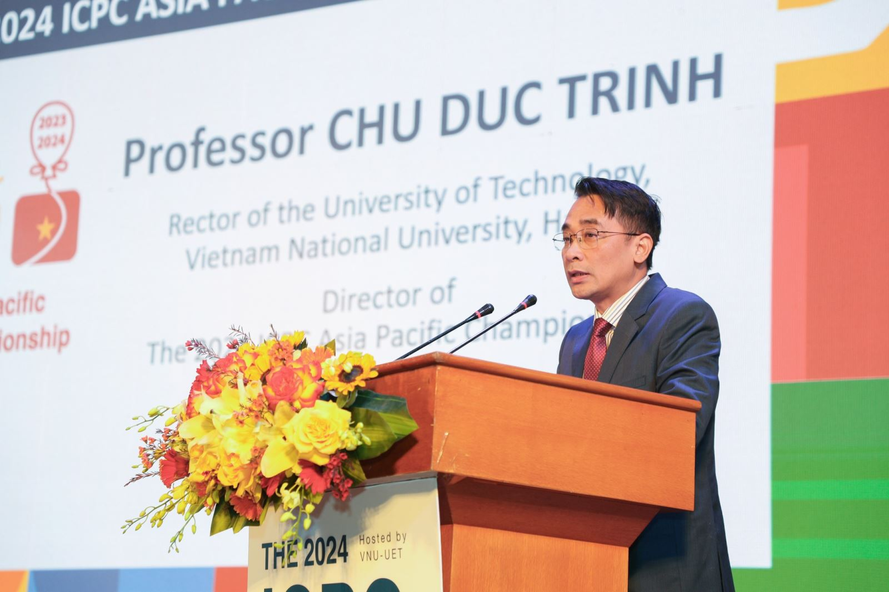
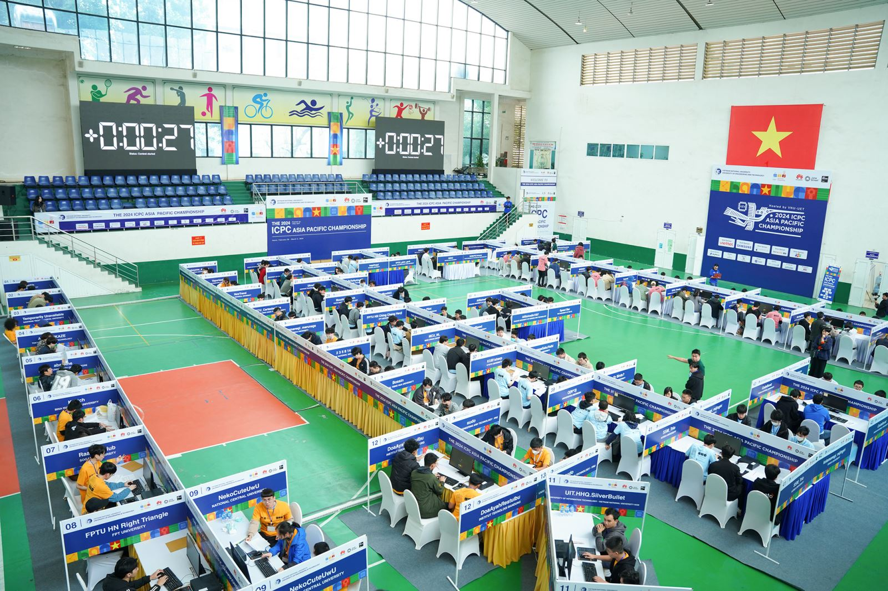
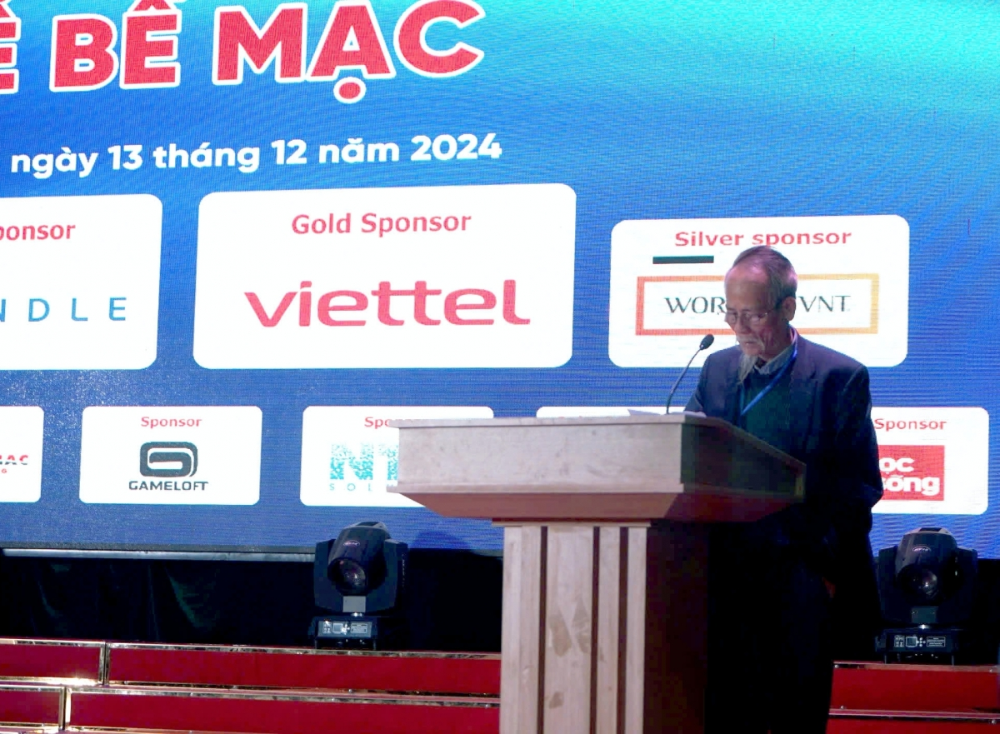
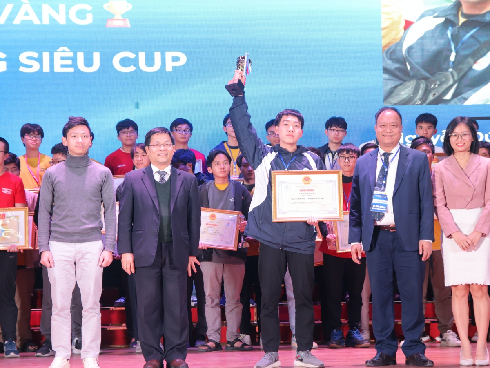
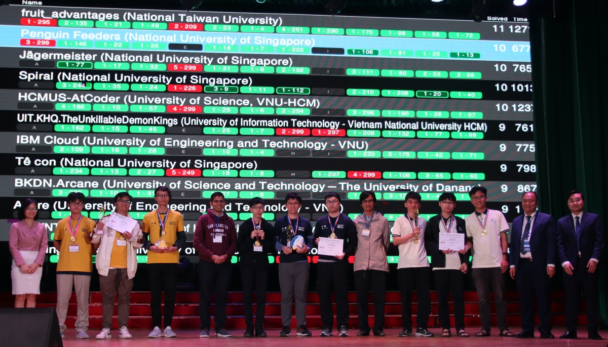
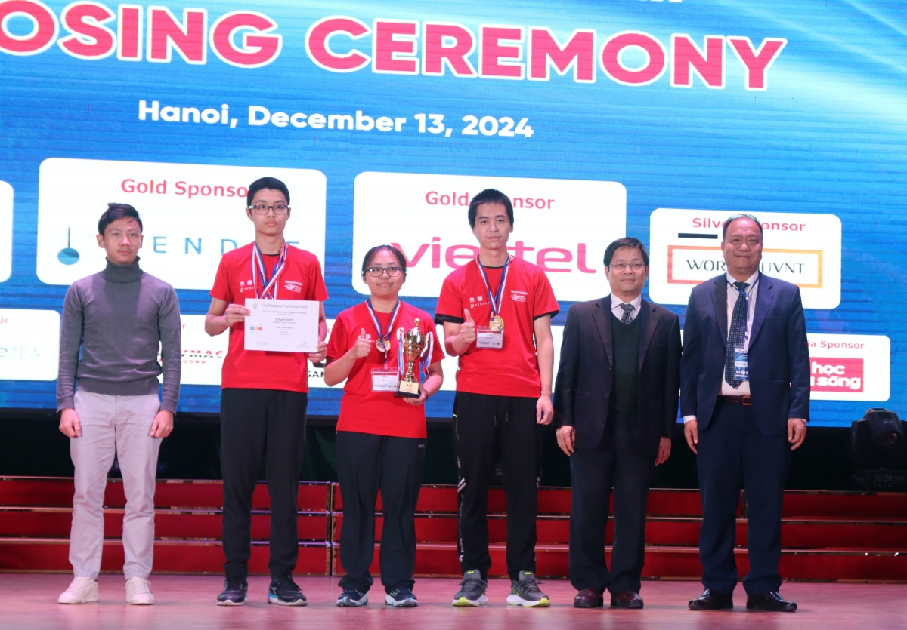
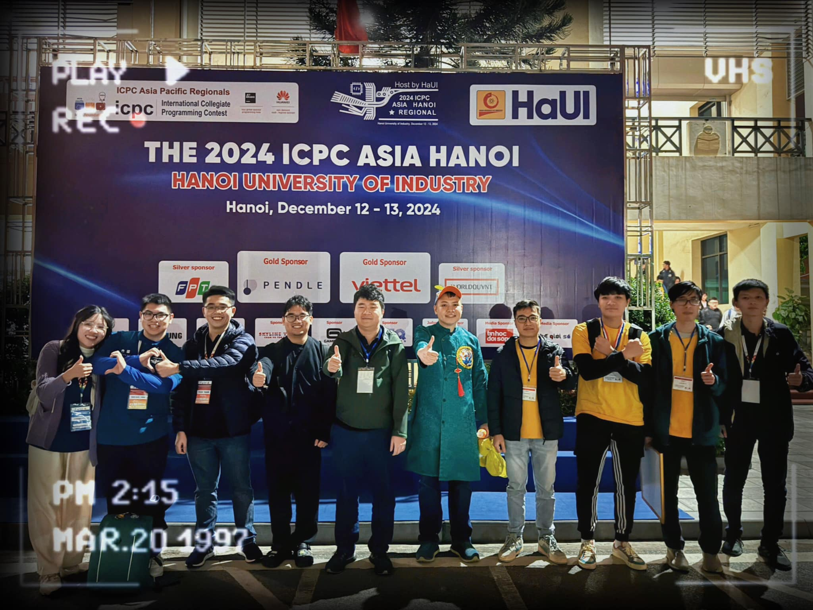

## ICPC Asia Pacific Championship 2024

Vào cuối năm 2023, khu vực Châu Á - Thái Bình Dương đã tổ chức 5 điểm thi ICPC Asia Pacific Regional tại: Taoyuan - 23/10 (Đài Loan), Seoul - 25/11 (Hàn Quốc), Yokohama - 26/11 (Nhật Bản), Jakarta - 04/12 (Indonesia), Hue City - 08/12 (Việt Nam). Nối tiếp những thành công của ICPC Asia Hue City 2023, nhằm chọn ra những đội thi xuất sắc đại diện Asia Pacific tham dự Chung kết ICPC toàn cầu năm 2024 tại Kazakhstan, các thí sinh phải cạnh tranh Ngôi vị Vô địch và 16 suất tham dự ICPC World Finals qua Chung kết ICPC Asia Pacific. Với thể thức mới được áp dụng từ kỳ ICPC 2024, Hà Nội đã chính thức trở thành địa điểm đầu tiên được đăng cai tổ chức Chung kết ICPC Asia Pacific 2024 phối hợp với ICPC Việt Nam và ICPC Asia Pacific.

Kỳ thi diễn ra từ ngày 29/02 - 03/03/2024 tại Trường Đại học Công nghệ, Đại học Quốc gia Hà Nội. Kỳ thi đã được tổ chức trực tiếp thi đấu trong 5 tiếng từ 9h00 - 14h00 ngày 02/03/2024 tại Khu thi ICPC tại Trường Đại học Công nghệ, Đại học Quốc gia Hà Nội. Kỳ thi được diễn ra trên Hệ thống chuẩn Quốc tế ICPC được ICPC Toàn cầu và Asia Pacific chỉ định và vận hành, phần mềm giám sát thi đấu của Việt Nam do VNOI vận hành.

Kỳ thi quy tụ 65 đội thi đến từ các trường đại học hàng đầu của Hàn Quốc, Nhật Bản, Indonesia, Singapore, Việt Nam,... Trong đó, Việt Nam góp mặt 12 đại diện đến từ cả ba miền:

- Đại học Bách khoa Hà Nội: HUST Kite;
- Đại học Công nghệ, Đại học Quốc gia Hà Nội: sudo, cat, rmdir;
- Đại học FPT Hà Nội: FPTU Ching Cheng Hanji, FPTU Right Triangle;
- Đại học Bách khoa Đà Nẵng: BKDN.LeaderTurnsBack;
- Đại học Khoa học tự nhiên, Đại học Quốc gia Thành phố Hồ Chí Minh: HCMUS-SmokinTomatoes, HCMUS-ExploringWorld, HCMUS-PeTalNyKing;
- Đại học Công nghệ Thông tin, Đại học Quốc gia Thành phố Hồ Chí Minh: UIT.HHQ.SilverBullet;
- Đại học Sư phạm Kỹ thuật Thành phố Hồ Chí Minh: HCMUTE.Fortune.

Sau 5 tiếng thi đấu căng thẳng, ngôi vô địch ICPC Asia Pacific Championship 2024 đã thuộc về đội tuyển NewTrend đến từ Đại học Quốc gia Seoul (Hàn Quốc). Từ kết quả kỳ thi, Việt Nam có ba đại diện xuất sắc giành được tấm vé tham dự ICPC World Finals 2024, chính là:

- UET sudo (Trường Đại học Công nghệ, Đại học Quốc gia Hà Nội): Phạm Quốc Hùng, Hoàng Ngọc Bảo Khuê, Phạm Xuân Trung
- HUST Kite (Trường Đại học Bách khoa Hà Nội): Nguyễn Anh Tiến, Phạm Hoàng Tiến, Nguyễn Tấn Dũng
- HCMUS-ExploringWorld (Trường Đại học Khoa học Tự nhiên, Đại học Quốc gia Thành phố Hồ Chí Minh): Lê Hữu Nghĩa, Lê Minh Hoàng, Vũ Hoàng Tùng

## Olympic Tin học Sinh viên Việt Nam và ICPC Asia Hanoi 2024

Kỳ thi Olympic Tin học Sinh viên Việt Nam lần thứ 33, kỳ thi PROCON Việt Nam và kỳ thi Lập trình sinh viên Quốc tế ICPC Asia Hanoi 2024 được tổ chức tại Đại học Công nghiệp Hà Nội từ ngày 10 - 13/12/2024. Kỳ thi quy tụ gần 700 coders xuất sắc nhất đến từ 78 trường đại học, cao đẳng, học viện trên khắp cả nước; cùng với đó là 20 đội tuyển ICPC Quốc tế tài năng đến từ Singapore, Hàn Quốc, Indonesia, Thái Lan, Philippines và Đài Loan. Kỳ thi năm 2024 có quy mô lớn nhất từ trước đến nay với hơn 700 thí sinh và 180 huấn luyện viên đến từ 116 trường đại học, cao đẳng, học viện trên cả nước và các quốc gia Singapore, Hàn Quốc, Đài Loan, Thái Lan.

Đối với kỳ thi Olympic Tin học Sinh viên Việt Nam, các vị trí dẫn đầu mỗi khối thi như sau:

- Vô địch khối Siêu Cúp: bạn Nguyễn Đức Thắng - Đại học Kinh tế Quốc dân
- Vô địch khối Chuyên Tin: bạn Đỗ Anh Khoa - Trường Đại học Công nghệ thông tin, Đại học Quốc gia Thành phố Hồ Chí Minh
- Vô địch khối Không Chuyên & Cao Đẳng: bạn Đinh Văn Tùng - Trường Đại học Thủy Lợi

Giải đồng đội khối Chuyên Tin và Không Chuyên của kỳ thi lần lượt thuộc về Đại học Bách khoa Hà Nội và Đại học Kinh tế Quốc dân. Như thông lệ, ngoài ra ban tổ chức còn trao thêm giải nữ sinh xuất sắc nhất dành cho các "bông hồng" đã tham gia kỳ thi. Cụ thể, bạn Nguyễn Thanh Tâm - Trường Đại học Ngoại Thương, Cơ sở II tại Thành phố Hồ Chí Minh với giải Ba khối Không Chuyên cùng với bạn Trần Hương Ly - Trường Đại học Ngoại Thương với giải Nhất khối Chuyên Tin, đã xuất sắc được trao giải thưởng này.

Còn đối với kỳ thi Lập trình sinh viên Quốc tế ICPC Asia Hanoi 2024, ngôi vô địch thuộc về đội tuyển fruit_advantages đến từ Đại học Quốc gia Đài Loan, sau màn bức phá AC thành công bài I ở phút thứ 290, nâng tổng số bài giải được lên 11/13 bài. Riêng Việt Nam có hai đội tuyển xuất sắc giành được huy chương vàng là HCMUS-AtCoder (Trường Đại học Khoa học tự nhiên, Đại học Quốc gia Thành phố Hồ Chí Minh) và UIT.KHQ.TheUnkillableDemonKings (Trường Đại học Công nghệ thông tin, Đại học Quốc gia Thành phố Hồ Chí Minh). Kết quả của vòng thi này là cơ sở để lựa chọn ra các đội tuyển xuất sắc tranh tài ở ICPC Asia Pacific Championship 2025 tại Singapore vào tháng 03/2025.

## VNOI đồng hành cùng Olympic Tin học Sinh viên Việt Nam

Năm 2024 đánh dấu năm thứ tư VNOI đồng hành cùng các kỳ thi ICPC và Olympic Tin học Sinh viên. Kế thừa và phát triển công nghệ, kỹ thuật và kinh nghiệm từ các năm trước, VNOI tiếp tục hỗ trợ tổ chức các sự kiện diễn ra thuận lợi, tốt đẹp.

Trong các kỳ thi kể trên, VNOI rất vinh dự và tự hào khi hệ thống chấm thi cũng như hệ thống giám sát thi do chính VNOI thiết kế dựa trên bản máy thi của ICPC World Finals được đưa vào sử dụng. Các hệ thống đều nhận được nhiều phản hồi tích cực từ ban tổ chức và các thí sinh dự thi, cả thí sinh trong nước lẫn thí sinh quốc tế. Riêng đối với hệ thống máy ảo thi, so với lần đầu sử dụng tại kỳ thi ICPC Regional Hue City 2023, đến nay hệ thống đã được cập nhật và hiệu chỉnh nhiều tính năng, góp phần giúp thí sinh có những trải nghiệm làm bài tốt nhất. Đặc biệt, với cải tiến ở tính năng in ấn mã nguồn, chỉ mất một thời gian rất ngắn để bản in tới được tay thí sinh từ khi yêu cầu được gửi đi, góp phần nâng cao hiệu quả thi đấu của các đội tuyển ICPC.

## Lời kết

Năm 2024 là một năm thành công của cộng đồng lập trình Việt Nam với những thành tích đáng nể tại các đấu trường quốc tế. Đây chính là minh chứng rõ nét cho tài năng và sự nỗ lực không ngừng của các bạn sinh viên, của thế hệ các bạn trẻ yêu thích lập trình.

VNOI, với vai trò là cầu nối giữa các lập trình viên trẻ và các cuộc thi quốc tế, đã đóng góp không nhỏ vào sự phát triển của cộng đồng lập trình Việt Nam. Hệ thống chấm thi và giám sát thi do VNOI xây dựng đã đảm bảo tính công bằng và minh bạch cho các kỳ thi, đồng thời tạo điều kiện thuận lợi cho các thí sinh thể hiện hết khả năng của mình.

Những thành công này là nguồn động viên lớn cho thế hệ trẻ Việt Nam, khẳng định vị thế của Việt Nam trên bản đồ lập trình thế giới. Có thể nói, các cuộc thi như ICPC và Olympic Tin học Sinh viên Việt Nam không chỉ là nơi để các bạn sinh viên thể hiện tài năng mà còn là nơi để các bạn trẻ học hỏi, giao lưu và cùng nhau phát triển. Trong năm tới và trong tương lai, VNOI vẫn sẽ tiếp tục đồng hành và hỗ trợ cộng đồng lập trình Việt Nam phát triển, qua việc tổ chức các hoạt động và duy trì các cuộc thi chất lượng cao.
