## Đồng hành với ICPC và Olympic Tin học Sinh viên 2024

Năm 2024 đánh dấu năm thứ tư VNOI đồng hành cùng các kỳ thi ICPC và Olympic Tin học Sinh viên. Kế thừa và phát triển công nghệ, kỹ thuật và kinh nghiệm từ các năm trước, VNOI tiếp tục hỗ trợ tổ chức các sự kiện diễn ra thuận lợi, tốt đẹp.

Vào tháng 3, ICPC Asia Pacific Championship lần đầu tiên được tổ chức, do Trường Đại học Công Nghệ, Đại học Quốc gia Hà Nội đăng cai, đã khép lại với thành công rực rỡ. Đây là kỳ thi mang ý nghĩa đặc biệt quan trọng, quyết định tư cách tham dự vòng Chung kết thế giới ICPC World Final của các đội tuyển. Giải đấu quy tụ 195 sinh viên của 65 đội tuyển và 50 huấn luyện viên, đại diện cho 39 trường đại học hàng đầu từ Nhật Bản, Hàn Quốc, Đài Loan, Singapore, Thái Lan, Indonesia và Việt Nam.

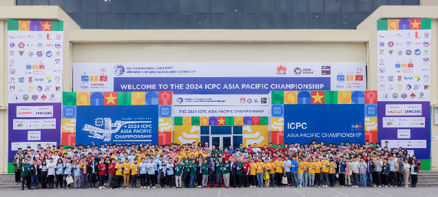

Đáng chú ý, đây cũng là lần đầu tiên VNOI trực tiếp hỗ trợ kỹ thuật cho một sự kiện tầm cỡ khu vực và quốc tế, với hệ thống giám sát thi do VNOI phát triển được hội đồng chỉ định sử dụng, nhằm đảm bảo tính công bằng và minh bạch cho kỳ thi.

Tháng 12, ICPC Asia Hanoi 2024 đã diễn ra thành công với nhiều điểm sáng trong khâu tổ chức và xuyên suốt kỳ thi. Đặc biệt có thể kể đến việc hỗ trợ in mã nguồn trong quá trình thi, chỉ mất một thời gian rất ngắn để bản in tới được tay thí sinh từ khi yêu cầu được gửi đi.

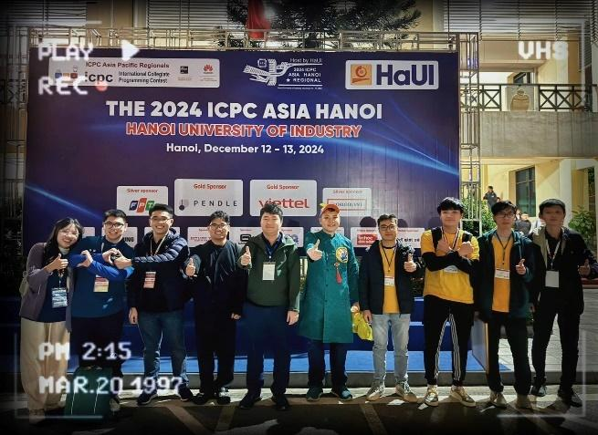

## VNOI Roadmap

Lập trình thi đấu là môn học xuất hiện muộn hơn các môn khoa học khác và là môn học đặc thù. Không như các môn văn hóa phổ thông, môn học này ban đầu được giảng dạy trong chương trình chuyên Tin, sau đó được điều chỉnh, giảm tải để phù hợp với chương trình phổ thông. Vì vậy, các tài liệu tham khảo dành cho người tự học hiện nay không nhiều và chưa được hệ thống hóa, đồng thời số thầy cô có thể giảng dạy bộ môn này cũng còn hạn chế. Do đó, các bạn học sinh, sinh viên muốn tự học, tự phát triển để tham gia các kỳ thi gặp rất nhiều khó khăn, đặc biệt trong việc xác định lộ trình học tập.

Thấu cảm khó khăn mà các bạn gặp phải, VNOI đã thực hiện dự án VNOI Roadmap, giúp các bạn tự định hướng trong việc học tập, chuẩn bị kiến thức cho các kỳ thi quan trọng. Roadmap là một lộ trình hoàn chỉnh bao gồm các chủ đề được đánh giá độ khó từ 1 đến 5 sao, dành cho mọi đối tượng học sinh, sinh viên hay những người đam mê lập trình thi đấu.

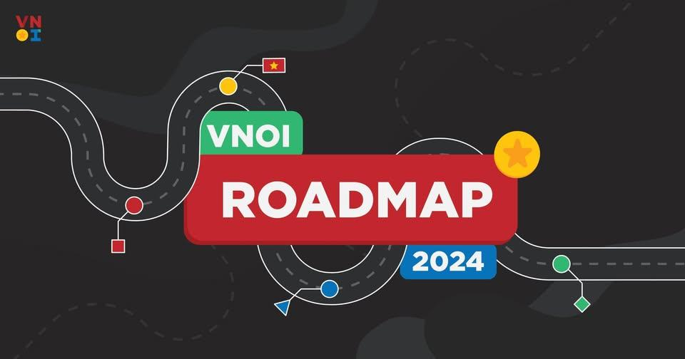

VNOI Roadmap là sự đúc kết kinh nghiệm của các thế hệ đi trước, đã trải và vượt qua nhiều cuộc thi trong suốt những năm vừa qua. VNOI hy vọng Roadmap 2024 sẽ giúp việc tự học Lập trình thi đấu của các bạn trở nên dễ dàng hơn, đóng góp thật nhiều vào phong trào Tin học nước nhà.

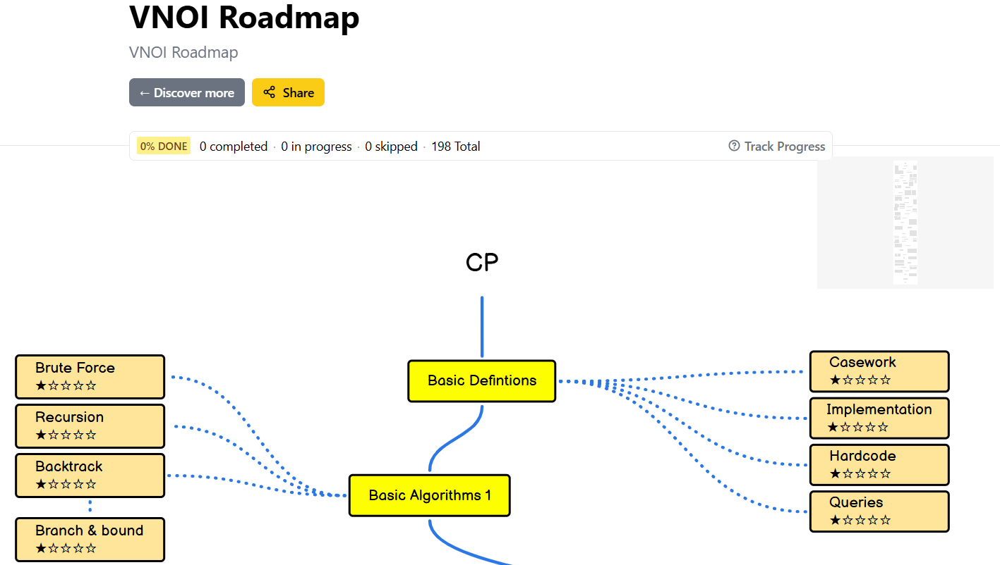

VNOI Roadmap đã được tải lên và công khai tại [roadmap.sh](https://roadmap.sh/r/vnoi-roadmap), một trang web nguồn mở cung cấp lộ trình chi tiết về việc tự học các kỹ năng khác nhau trong lĩnh vực Công nghệ thông tin.

## Phát triển dịch vụ VNOJ

Năm 2024 ghi dấu sự tăng trưởng đáng kể về lưu lượng sử dụng VNOJ, với số lượt nộp trung bình khoảng xxx lượt/ngày, trong đó 74% đến từ các Tổ chức. Đây vừa là cơ hội vừa là thách thức cho đội ngũ VNOI: cơ hội vì hệ thống được tin dùng rộng rãi bởi các bạn học sinh, sinh viên và các thầy, cô trên cả nước; thách thức vì cần bảo đảm hiệu suất, tốc độ ổn định trong bối cảnh lượng truy cập không ngừng gia tăng.

Để duy trì hệ thống lâu dài và bền vững, VNOI đã tăng công suất máy chấm lên gấp rưỡi, đồng thời ban hành bộ quy định cho việc sử dụng tính năng Tổ chức trên VNOJ. Hướng dẫn chi tiết và danh sách những câu hỏi thường gặp đã được VNOI đăng tải, giải đáp trên [fanpage chính thức của VNOI](https://www.facebook.com/share/p/1BRjGDxqDC/).

Song song đó, nhằm khắc phục các hạn chế của tính năng Tổ chức và tăng cường hiệu quả dạy – học, VNOI quyết định cung cấp dịch vụ hỗ trợ duy trì, vận hành một hệ thống chấm bài độc lập cho các tổ chức giáo dục có nhu cầu. Thông tin đầy đủ về dịch vụ này có trong [thông báo hính thức về việc cung cấp trang chấm bài độc lập](https://drive.google.com/file/d/1bVHDJOer2yzSILHgaO-Z-D9_trQxdjpV/view?fbclid=IwY2xjawH-ljpleHRuA2FlbQIxMAABHTesPuGOW5ZjfNESvmugTxyQl6kHjSS-b_OsMl4mt6PS2uYMAsfju6zxTg_aem_kKVieMF_pxbn0z7kyUU_4A).

## VNOI Cup 2024

Năm 2024, VNOI tiếp tục tổ chức VNOI Cup, một kỳ thi thường niên thu hút số lượng đông đảo các thí sinh có profile “khủng” tham gia tranh tài. VNOI Cup năm nay có nhiều điểm mới so với hai lần tổ chức trước: Không còn giới hạn độ tuổi tham dự và số lượng thí sinh được tham dự vòng chung kết tăng lên 24, gấp đôi so với năm 2023.

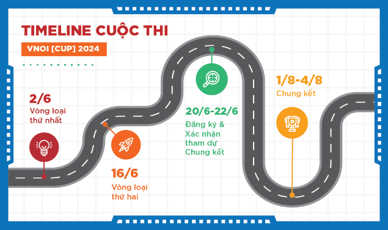

Các thí sinh VNOI Cup 2024 phải trải qua hai vòng loại Online diễn ra trên nền tảng VNOJ, từ đó lấy cơ sở để lựa chọn những thí sinh xuất sắc nhất tham dự vòng Chung kết diễn ra tại Trường Đại học Khoa học tự nhiên, Đại học Quốc gia Thành phố Hồ Chí Minh.

Sau hai vòng thi, danh sách thí sinh tham dự vòng Chung kết VNOI Cup 2024 đã lộ diện, trong đó có rất nhiều gương mặt quen thuộc từ hai mùa giải trước và cũng xuất hiện rất nhiều “nhân tố” mới. Đặc biệt, năm 2024 là lần đầu tiên Ban tổ chức ghi nhận có thí sinh cấp Trung học Cơ Sở giành được suất tham dự vòng Chung kết, đó là bạn Nguyễn Khánh Phúc, khi diễn ra Chung kết, bạn đang là học sinh lớp 8 của trường THCS Trương Hán Siêu, Ninh Bình.

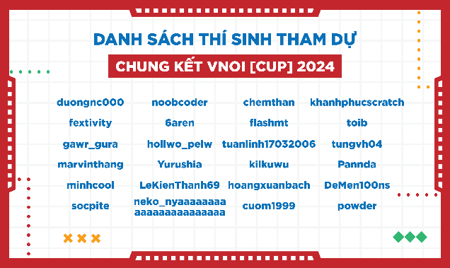

Trong 4 tiếng đầu của vòng Chung kết, Ban tổ chức phát trực tiếp cùng với bình luận thi trên fanpage để tất cả mọi người có thể theo dõi diễn biến kỳ thi từ xa. Riêng giờ thi cuối, việc phát trực tiếp được tạm dừng để đảm bảo bảo mật kết quả kỳ thi.

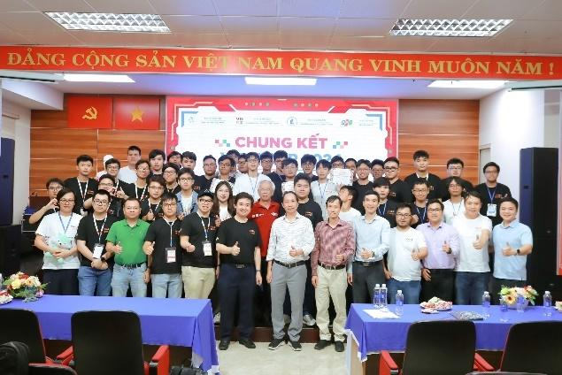

Sau 5 tiếng diễn ra kỳ thi, top 3 thí sinh xuất sắc nhất của VNOI Cup 2024 đã chính thức lộ diện. Tất cả đều là những gương mặt quen thuộc với cộng đồng Tin học Việt Nam. Vượt qua nhiều đối thủ mạnh, Trần Xuân Bách xuất sắc giành ngôi Quán quân; huy chương Bạc thuộc về Lê Phước Định; và giành được huy chương Đồng là Nguyễn Tấn Sỹ Nguyên. Các thí khác còn lại cũng đã rất xuất sắc khi đã vượt qua rất nhiều thí sinh để tiến vào vòng Chung kết, và đều nhận được những phần quà đặc biệt là những chiếc áo VNOI có in tên riêng của các bạn.

## VNOI và các dự án cộng đồng 2024

### Bedao Contest

Bedao Contest là một dự án được thành lập vào đầu năm 2020 nhằm mục đích tổ chức các kỳ thi, tạo ra sân chơi cho những bạn trẻ yêu thuật toán và coding. Bedao và VNOI chính thức bắt tay vào tháng 8/2021 và sát nhập như hiện nay.

Trong năm 2024, VNOI tiếp tục dự án Bedao Contest. Đặc biệt, đội ngũ Bedao Contest tiếp tục tổ chức 3 kỳ Bedao OI trước thềm kỳ thi Học sinh giỏi Quốc gia, nhằm giúp các bạn học sinh có một cơ hội luyện tập với trải nghiệm tương tự kỳ thi chính thức.

### Đồng hành với các bạn học sinh trong kỳ thi Học sinh giỏi Quốc gia

Trong ba năm trở lại đây, trước thềm kỳ thi Học sinh giỏi Quốc gia, VNOI đều duy trì việc liên hệ các anh, chị tiền bối để xin những ý kiến chia sẻ về việc thi cử và đăng tải lên fanpage cho các bạn học sinh tham khảo.

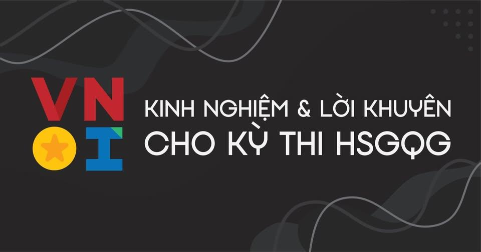

Sau hai ngày thi, VNOI tổ chức buổi chữa đề thi HSGQG môn Tin học, phát trực tiếp trên fanpage. Lời giải cho các bài tập được trình bày trong buổi chữa đề được chuẩn bị kỹ lưỡng và kịp thời, do đó nhận được sự hưởng ứng của cộng đồng, cao điểm buổi chữa có thể lên tới gần 600 lượt xem.

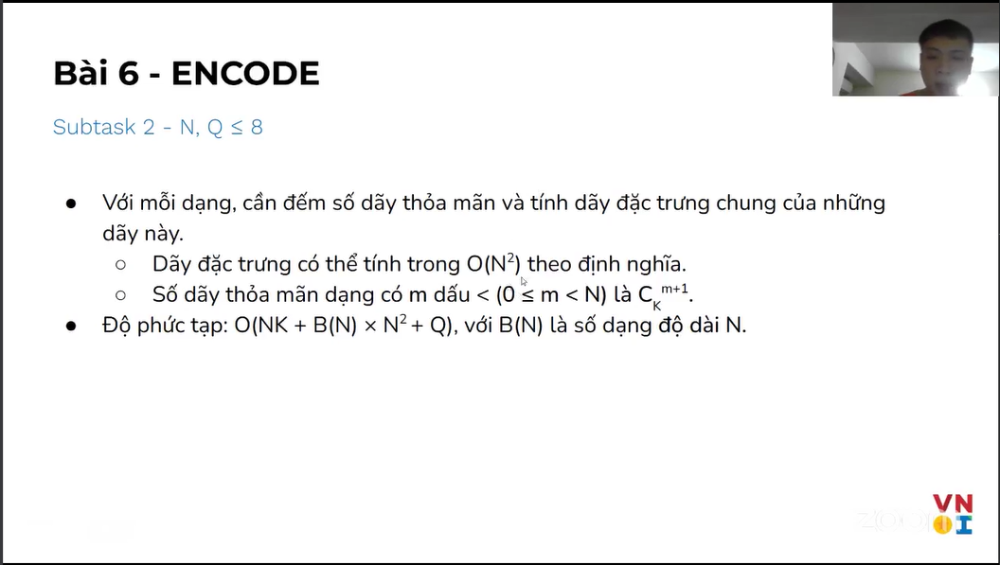

### VNOI Wiki

Trong năm qua VNOI vẫn duy trì dự án VNOI Wiki với hơn 19 bài viết chất lượng về các chủ đề trong Tin học đã được xuất bản bởi đội ngũ VNOI Wiki, nhiều kỹ thuật, thuật toán được đưa tới cộng đồng. Nổi bật nhất là việc nâng cấp giao diện VNOI Wiki giúp truyền tải hiệu quả hơn nội dung các bài viết cho cộng đồng.

### Tình nguyện viên Gen 4

Để duy trì các dự án phục vụ cộng đồng, VNOI rất cần sự giúp đỡ của các bạn Tình nguyện viên. Trong năm 2024, VNOI đã kết thúc và cấp giấy chứng nhận cho các bạn Tình nguyện viên thế hệ thứ 3 và vận động đăng ký Tình nguyện viên thế hệ thứ 4.

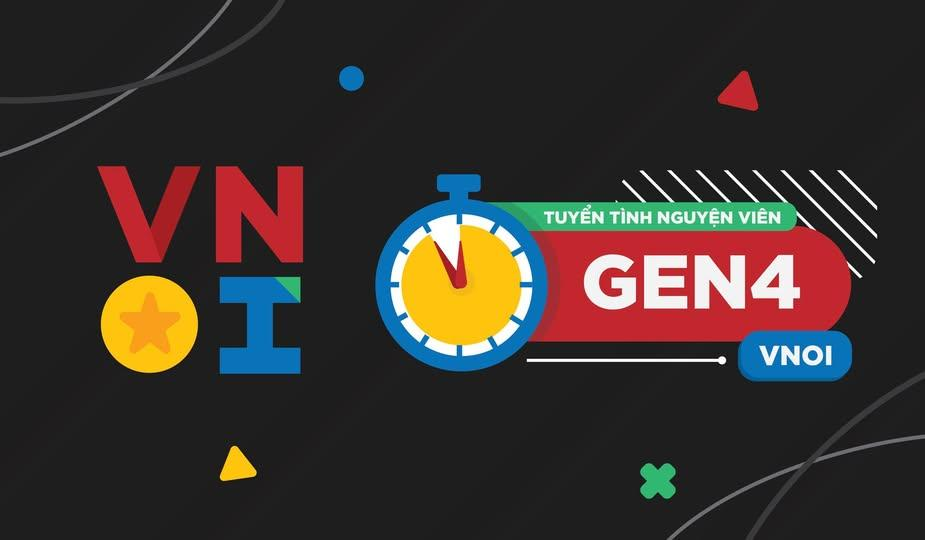

Nhằm gắn kết tình cảm giữa Tình nguyện viên với nhau, các hoạt động sinh hoạt được tổ chức thường xuyên vào các dịp đặc biệt tại hai thành phố lớn là Hà Nội và Thành phố Hồ Chí Minh.

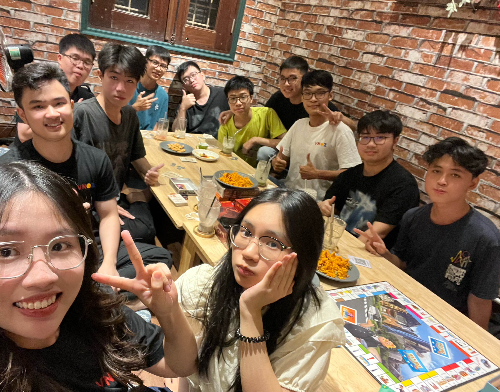

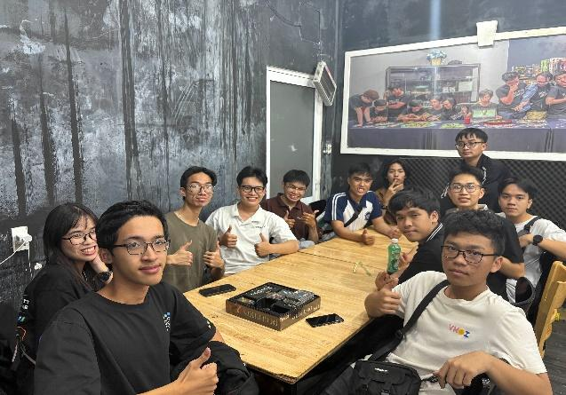

Ngoài gắn kết tình cảm tại các buổi sinh hoạt giữa các team TNV, VNOI còn tạo điều kiện cho các xây dựng tình yêu quê hương, đất nước qua các buổi tham quan bảo tàng hay các di tích lịch sử độc đáo tại thành phố Hà Nội & Hồ Chí Minh.

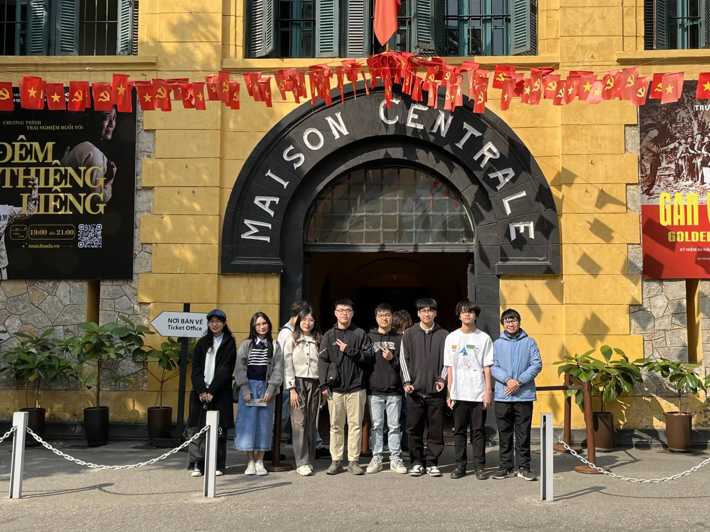

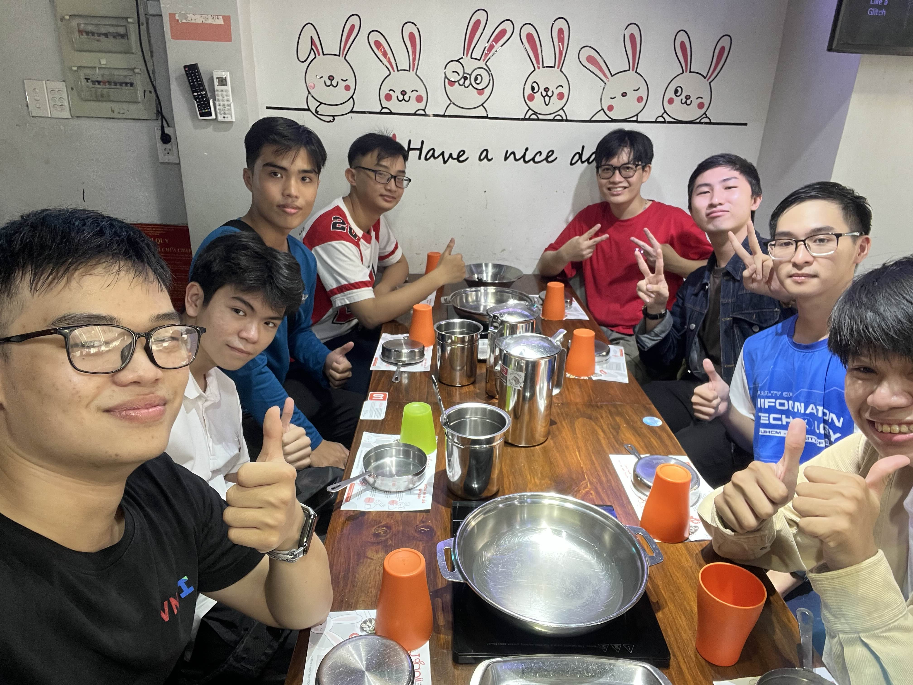
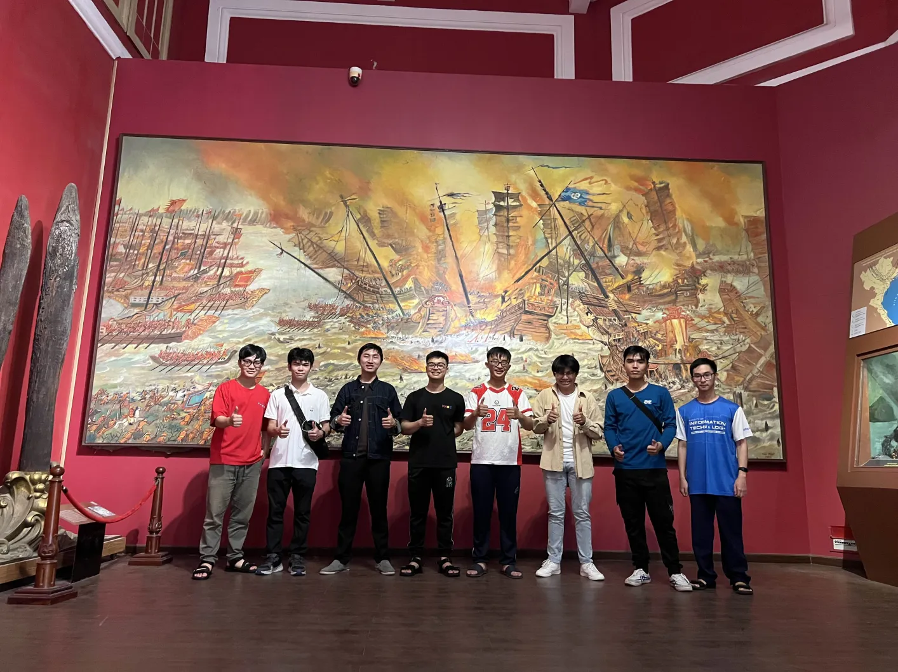

Những hoạt động của VNOI đều có dấu ấn đậm nét đến từ các bạn tình nguyện viên đã và đang âm thầm đóng góp chung cho nền Tin học nước nhà. Những dự án của VNOI sẽ không thành công nếu không có sự giúp sức và ủng hộ đến từ các bạn. VNOI xin chân thành cảm ơn các bạn, hy vọng rằng tinh thần của các bạn sẽ được lan tỏa tới những thế hệ tiếp theo.

### Chia sẻ của các bạn TNV Gen 4

#### Trần Quang Trường - Trường Đại học Công nghệ Thông tin, Đại học Quốc gia Thành phố Hồ Chí Minh

"Chào mọi người, em là Trần Quang Trường. Hiện tại, em đang là sinh viên năm nhất của trường Đại học Công nghệ Thông tin, ĐHQG-HCM và đã theo chân cùng với VNOI được 2 năm làm tình nguyện viên. Bắt đầu vào lúc em viết đơn ứng tuyển làm TNV VNOI, vào khoảng tháng 8 năm 2023. Em lo lắng khi điền vào đơn ứng tuyển. Vì yêu cầu ứng tuyển, không chỉ cần một background tốt mà cần có niềm đam mê, sự chăm chỉ và thái độ làm việc tốt, bởi thế việc được chọn để nằm trong 30 bạn xuất sắc nhất trong nhiều lá đơn khác nhau là rất đỗi khó khăn.

Với sự cố gắng và sự chờ đợi của mình, em đã không thất vọng khi sau khoảng một tháng, em đã nhận được mail trúng tuyển. Ngày em biết em đậu, em vui như được mùa, vui như cách em đậu vào trường Chuyên cấp 3 vậy!! Bởi việc đậu trong hơn hàng trăm đơn ứng tuyển của những bạn có cùng niềm đam mê khác là thử thách khó khăn.

Sau khi vào VNOI, em cùng các bạn TNV khác trong buổi meeting đầu khoá được hướng dẫn các hoạt động chung của nhóm và công việc chuyên môn của team em tham gia. Ví dụ như team contest chuyên về tổ chức tạo các kì thi để học tập cũng như luyện tập, team wiki chịu trách nhiệm việc soạn các bài viết về các thuật toán để đưa tin học nước nhà gần hơn với các bạn học sinh sinh viên, v.v.

Sau buổi meeting, em có khoảng thời gian để làm quen với các công việc chuyên môn. Ở khoảng thời gian đầu này, em gặp đôi chút khó khăn khi chưa nắm rõ được cách sử dụng của Polygon lúc ở team contest hoặc không hiểu được các cú pháp của Markdown khi làm ở team wiki. Nhưng may mắn thay, em được anh chị trong team đã hỗ trợ rất nhiều để giúp em vượt qua giai đoạn làm quen đó. Nhờ quy trình làm việc theo nhóm nhỏ, em đã làm quen được một số bạn TNV khác. Các bạn này rất giỏi ở lĩnh vực lập trình thi đấu nói riêng và ngành công nghệ thông tin nói chung, và nhờ đó mà em đã học hỏi được rất nhiều thứ từ các bạn. Fun fact, teammate ICPC cùng với em sắp tới đi thi ICPC Asia Pacific Championship ở Singapore đều là TNV team contest chung với em.

Cứ mỗi tháng, VNOI tổ chức buổi meeting tổng kết tháng vừa qua. Điều em ấn tưởng nhất ở buổi meeting này chính là bản nhạc quay xổ số huyền thoại khi quay số cho ai may mắn được nhận thưởng cho tháng vừa qua. Càng làm nhiều sẽ tăng tỉ lệ trúng khi tăng số tên xuất hiện trên bảng xổ số, nhưng trúng hay không sẽ tuỳ thuộc vào may mắn của bạn. Và rất "may mắn" vì hầu như tháng mình đều nhận được thưởng.

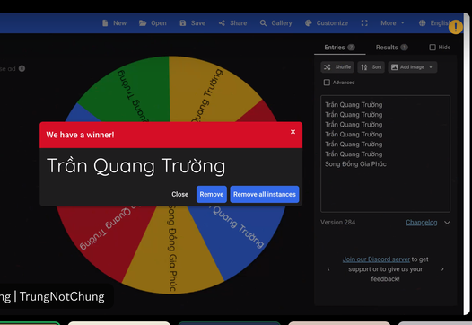

Sau khi quay xổ số xong, VNOI thường tổ chức chơi game chung hoặc văn nghệ các kiểu. Và bài văn nghệ em ấn tượng nhất lại buồn cười chính là bài em biểu diễn vào Tết năm ngoái:
[QioCas mặc áo VNOI lắc lư trong điệu nhạc Tết](https://www.youtube.com/watch?v=ImGf6zX7e2o). Tuy em múa không đẹp nhưng tiết mục múa của em ngày hôm đó đã để lại những ấn tượng khó quên đối với mọi người vào dịp Tết năm ấy.

Ngoài những buổi meeting cuối tháng, VNOI thường mời những anh lớn có 'máu mặt' trong ngành để chia sẻ và bàn về những đề tài như hướng nghiệp đi làm, làm sao để có một buổi phỏng vấn thật tốt, cách viết CV, hoặc chia sẻ những kinh nghiệm thi cử như kì thi Quốc gia, ICPC. Qua các buổi như vậy, em đã học hỏi những kiến thức giúp em phát triển trên con đường của bản thân mình.

Vào dịp Tết nguyên đán, VNOI cũng gửi quà chúc mừng tết là những bao lì xì xinh xắn cùng với chiếc áo VNOI. Về chiếc áo, đây như một ghi nhận hành trình của em tại VNOI. Mặc lên mà em cứ ngỡ mặt long bào, ngạo nghễ khi đi khoe với đám bạn cũng như các bà hàng xóm. 'Áo này con được cộng đồng Olympic tin học Việt Nam tặng á các cô chú.'! Về bao lì xì cũng có một câu chuyện vui, sau khi lên trường sau Tết em có tổ chức contest để mọi người trong đội tuyển tham gia sau đó tặng những phong bì VNOI với mệnh giá tuỳ thuộc vào số bài đã AC. Oách xà lách vô cùng.

Một kì TNV khoảng 3-4 lần, VNOI tổ chức buổi gặp mặt trực tiếp tại hai đầu Nam Bắc. Thường sẽ là buổi gặp mặt ăn uống, đi chơi đâu đó, hoặc như năm nay em được đi thăm quan các di tích lịch sử. Lúc đầu gặp mặt em có hơi ngại vì hướng nội nhưng nhờ sự nhiệt tình giúp đỡ của anh chị nên em đã đỡ hơn. Qua buổi gặp mặt trực tiếp, em đã làm quen thêm được những người bạn ở team khác mà bình thường em chưa tiếp xúc. Tuy là một buổi ngắn ngủi nhưng đã đọng lại trong em nhiều điều quý giá.

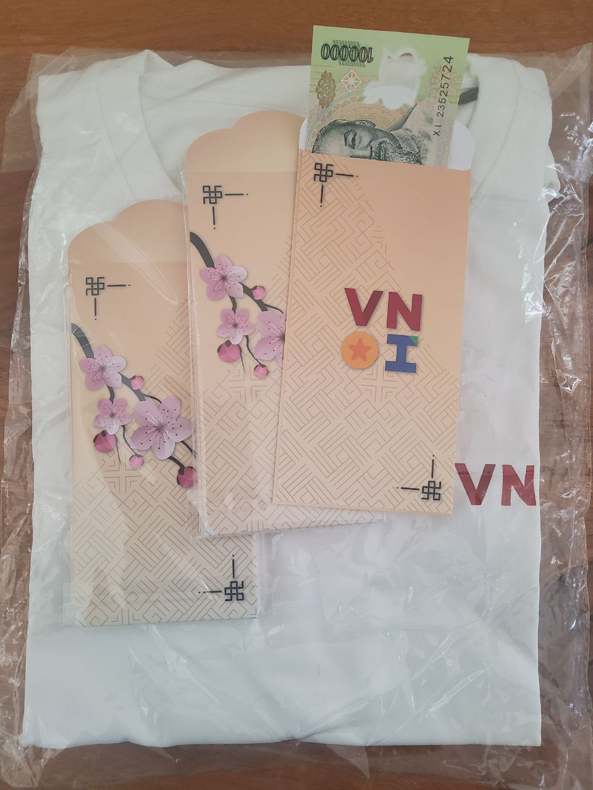

Nhiều người thường hay bảo: "Làm TNV có gì đâu, làm chi cho cực". Đúng, đã làm một TNV là trên tinh thần tự nguyện không màng lợi ích. Tuy nhiên không vì thế mà bảo làm TNV không được gì, nhờ làm TNV VNOI em đã có cơ hội được làm quen được những người bạn mới, được học hỏi được nhiều kiến thức qua các buổi seminar, và cũng như rèn giũa những kĩ năng cho bản thân (kĩ năng làm việc nhóm, kĩ năng giao tiếp, kĩ năng múa nhảy, …). Vậy còn "Làm TNV có cực không?" Đó là câu hỏi của bản thân em trước khi điền vào đơn ứng tuyển. Ở hai giai đoạn em viết đơn ứng tuyển là năm lớp 12 chuẩn bị cho kì thi HSGQG và đầu năm nhất chưa bắt nhịp được với cuộc sống sinh viên, thời điểm khó khăn trong việc ôn thi và chật vật với cuộc sống còn đầy điều bỡ ngỡ, em đã khá lo lắng khi sợ việc làm TNV ảnh hưởng tới bản thân. Nhưng nỗi lo ấy đã biến mất sau khi thật sự làm TNV, bởi mỗi tháng em được giao khá ít việc nên nhìn chung việc làm không quá áp lực. Việc được làm bởi sự đam mê dành tin học cũng là một phần khiến em thấy làm TNV vui hơn hết. Ngoài ra, VNOI rất quan tâm tới các TNV do đó em không những không thấy thiệt thòi mà còn được giúp đỡ nhiều trên quá trình phát triển của mình.

Và cứ như vậy, sau gần 10 tháng làm TNV, vào tháng 5 năm 2023, VNOI tổ chức cuối khoá gen 3 và gửi lời cảm ơn tới em cùng những bạn TNV cùng khoá vì đã đồng hành với VNOI trong suốt thời gian qua. Với món quà cuối cùng là những bộ sticker, hình dán, móc khoá và không thể thiếu chính là giấy chứng nhận TNV. Một tờ giấy minh chứng cho quá trình đồng thành với VNOI trong một năm vừa qua. Để mà nói, hành trình đồng hành với VNOI của em là một chặng đường quan trọng trên con đường phát triển bản thân mình. Nhờ VNOI, em học được nhiều thứ, rèn luyện, trau dồi những kĩ năng và tích luỹ cho bản thân những hành trang cần thiết cho sau này.

Một lần nữa, em xin cảm ơn VNOI vì tất cả. Em chúc VNOI tiếp tục phát triển để đưa nền tin học Việt Nam gần hơn với học sinh. Để mỗi nhà 5 mét vuông 1 Tourist, để Việt Nam đạt được những thành tích cao hơn trong những cuộc thi quốc tế. Một cái Tết nữa lại đến, em xin chúc mọi người trong VNOI cũng như tất cả bạn đang học tin học trên cả nước một cái Tết ấm no, tràn đầy niềm vui, gặp nhiều may mắn và thành công trên con đường sự nghiệp ạ."

#### Châu Tấn Phát - 12CTin, Trường THPT chuyên Trần Đại Nghĩa, TP.HCM

"Lúc mới bước vào cấp 3, vốn kiến thức về tin học của mình khá hạn hẹp, đặc biệt về CP, nên trong khoảng thời gian đầu cấp này mình quyết định tìm tài liệu để học những kiến thức cần có cho CP nói chung cũng như cho bộ môn Tin chuyên nói riêng. VNOI lúc ấy như người thầy của mình, thắp sáng trong mình một niềm yêu thích, đam mê với lập trình thi đấu, ngoài ra còn mang đến cho mình cả một chân trời kiến thức mới, hầu hết kiến thức mà mình học được đến từ các dự án VNOI Wiki và VNOJ. Contest online về CP đầu tiên mà mình làm là Bedao Mini Contest 11, mình khá ấn tượng về cách chấm bài online nhanh gọn trên VNOJ, khác với việc mình phải đợi rất lâu để được các thầy dạy đội tuyển hồi cấp 2 của mình chấm bằng Themis, trải nghiệm hoàn toàn mới này khiến mình có thêm động lực, hứng thú để tiếp tục làm các contest tiếp theo. Qua series contest Bedao, bản thân mình cảm thấy đã tiến bộ rất nhiều, lúc ấy mình cũng mong muốn có thể một ngày nào đó có thể tổ chức những contest như thế này. Và rồi mình biết đến khái niệm 'Tình nguyện viên VNOI' là những người đứng sau các contest nói trên và VNOI Wiki qua bài tuyển TNV Gen 3 trên page VNOI, từ đó mình tìm hiểu và nuôi hi vọng có thể trở thành TNV VNOI trong tương lai.

Một trong những lí do chính thôi thúc mình trở thành một TNV VNOI đó chính là mong muốn được đóng góp cho cộng đồng. Các dự án của VNOI đã giúp mình rất nhiều trên con đường theo đuổi lập trình thi đấu của mình, giúp mình tiến bộ hơn và đạt được những điều mà mình tưởng chừng như không thể, do đó mình cũng mong muốn có thể cùng VNOI tạo thêm nhiều giá trị tốt đẹp cho mọi người, nhất là những bạn có niềm yêu thích với tin học. Qua việc trở thành một tình nguyện viên, mình cũng mong muốn phát triển bản thân mình hơn, rèn dũa thêm kiến thức và kĩ năng mềm, đồng thời tạo thêm nhiều sự kết nối và mối quan hệ với những người có cùng niềm yêu thích với mình, mình nghĩ quá trình giao lưu và học hỏi này sẽ giúp bản thân mình ngày càng trở thành phiên bản tốt nhất. Một lí do khác là vì mình thấy icon 'lửa' ở tên dành cho TNV trên VNOJ khá ngầu, và cách duy nhất để đạt được là trở thành một TNV VNOI. Mình cũng thích các sản phẩm, merch của VNOI như áo, sticker hay móc khóa, vì thế trở thành TNV cũng phần nào hiện thực hóa được ước mơ nhỏ nhoi này của mình, tạo thêm cơ hội để 'flex' với bạn bè. Ngoài ra, làm TNV VNOI, mình còn được tham gia các buổi talkshow, workshop với các gương mặt nổi tiếng của Tin học Việt Nam, được giao lưu, học hỏi với nhiều người giỏi, trau dồi các kĩ năng mềm và nhiều nhiều lợi ích khác nữa.
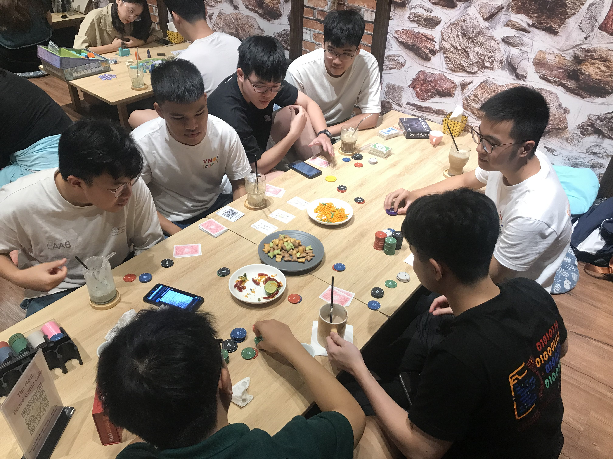

Do đã đặt mục tiêu và quyết tâm về việc trở thành TNV VNOI từ trước, khi thời điểm tháng 8 cận kề, hầu như ngày nào mình cũng vào page VNOI để xem tin tức về việc tuyển thành viên, và khi bài viết ấy được đăng lên - thứ mà mình đã mong chờ bấy lâu, mình biết thời khắc ấy đã đến. Đọc từng dòng trong file mô tả công việc, mình cảm thấy yêu thích và hứng thú với việc trở thành thành viên của ban contest, vì mình không giỏi về mảng kĩ thuật hay đủ khả năng viết để viết tài liệu wiki, một phần khác vì đây là ban tuyển nhiều thành viên nhất, nên mình nghĩ khả năng đậu sẽ cao hơn. Ngoài ra, khi làm thành viên ban contest, mình có thể trau chuốt thêm về kĩ năng và kiến thức lập trình thi đấu của mình, cũng như hiểu được cách tạo một problem hay lớn hơn là quy trình tổ chức một contest, đồng thời mình cũng mong muốn có thể đóng góp thêm những bài toán hay ho trong kho bài tập của VNOI. Bắt tay vào việc điền vào đơn tuyển, mình cố gắng hết sức để lá đơn trở nên thật chỉn chu và hoàn hảo nhất. Các câu hỏi trong đơn tuyển tuy không nhiều và không quá dài, nhưng làm ngốn thời gian của mình rất nhiều. Mỗi ngày mình đều bật máy lên để xem lại các thông tin đã điền để thêm thắt và chỉnh sửa, với mục đích để lá đơn của mình nổi bật nhất có thể do mình biết còn rất nhiều bạn cũng đang mong ước được làm một phần của team VNOI như mình. Rồi cũng đến lúc đóng hạn nộp đơn, mình review và chỉnh sửa vài lần trước khi gửi. Sau đó đơn tuyển được gia hạn thêm vài tuần, vì đã soạn sẵn từ trước nên trong 2 tuần mình cũng không chỉnh sửa gì nhiều. Quãng thời gian chờ đợi kết quả, ngày nào mình cũng ngồi đọc các tin nhắn trong server discord của VNOI để xem có ai bàn luận về lần tuyển TNV này không, mình check mail và mở page VNOI trên facebook thường xuyên hơn, với mong muốn nhận được mail thông báo kết quả đợt tuyển càng sớm càng tốt. Ngày nhận được kết quả chính thức trở thành một TNV, mình rất vui nhưng cũng đan xen hồi hộp, vui vì mình đã hoàn thành được mục tiêu của mình, hồi hộp và lo lắng vì không biết nhiệm kì sắp tới của mình sẽ trải qua những gì, sẽ gặp những ai, sẽ học được điều gì mới.

Hành trình trở thành tình nguyện viên VNOI có lẽ sẽ là một trong những quãng thời gian đáng nhớ nhất của mình, vì có lẽ mình của trước đây cũng không thể nghĩ rằng mình có thể trở thành một phần của VNOI, do đó việc trở thành TNV mang lại ý nghĩa rất to lớn với mình. Dù chỉ mới trải qua một nửa nhiệm kì Gen 4, nhưng mình cũng đã cảm nhận được tinh thần và sự tận tụy trong công việc của các thành viên khác trong khi bản thân vẫn chưa đóng góp được nhiều, từ đó tạo thêm động lực trong mình để có thể tiếp tục cố gắng góp phần giúp cộng đồng lập trình thi đấu ở Việt Nam ngày một lớn mạnh hơn nữa."
